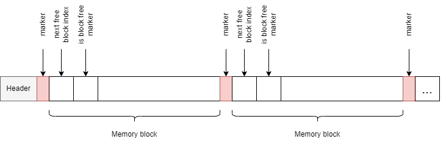
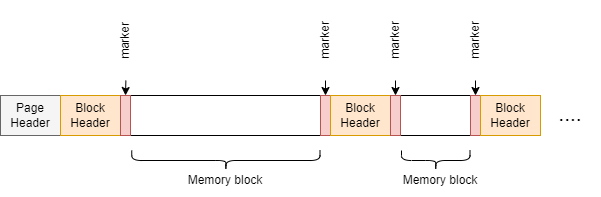
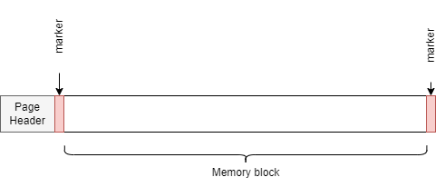

# Memory Manager
___
# Задача:
Необходимо реализовать универсальный менеджер памяти на
основе использования подходов Fixed-size Memory Allocation (FSA) и Coalesce
Allocation с Free-List. FSA должен использоваться для выделения блоков
размером 16, 32, 64, 128, 256 и 512 байт, все запросы блоков размером
больше 10Мб передаются непосредственно ОС
#### 1) FSA-аллокатор:
В начале каждой страницы размещена структура Header:
```c++
struct Header
{
	Header* next; // 8 байт, указатель на следующую страницу
	int fHead;    // 4 байта, индекс первого свободного блока (голова free-list)
	int numInitialized; // 4 байта, количество занятых блоков
};
```
Структура Debug-аллокатора:

- Для отслеживания Segmentation Fault в Debug-версии используются маркеры, каждый размером 8 байт; в Release-версии эти маркеры отсутствуют.
- Каждый блок содержит индекс следующего свободного блока в списке free-list.
- При аллоцировании памяти блок удаляется из free-list, изменяется индекс головы free-list fHead.
- При освобождении памяти блок добавляется в голову free-list, заполняются метаданные внутри этого блока.
- Перед деинициализацией аллокатора осуществляется проверка на наличие утечек памяти (не был вызван метод free)

#### 2) Coalesce-аллокатор:
В начале страницы размещена структура Header:
```c++
    // 24 bytes
	struct Header
	{
		Header* next;      //  Указатель на следующую страницу
		dataBlock* head;   //  Указатель на голову списка всех блоков на странице (блоки расположены последовательно)
		dataBlock* headFL; //  Указатель на голову free-list
	};
}
```
Перед каждым свободным блоком памяти расположена структура dataBlock, содержащая метаданные:
```c++
	struct dataBlock   // 40 bytes
{
	dataBlock* next;   // Следующий блок (лежит за текущим блоком в памяти)
	dataBlock* prev;   // Предыдущий блок (лежит перед текущим блоком в памяти)
	dataBlock* nextFL; // Следующий свободный блок из free-list
	dataBlock* prevFL; // Предыдущий свободный блок из free-list
	int size;          // Размер блока
	bool inUse;        // Свободен ли блок
};
```
Структура аллокатора:


- Для отслеживания Segmentation Fault в Debug-версии используются маркеры, каждый размером 8 байт; в Release-версии эти маркеры отсутствуют.
- При аллоцировании памяти блок подходящего размера ищется согласно стратегии First-fit в free-list
- При освобождении памяти блок объединяется с соседними блоками, если они свободны
- Перед деинициализацией аллокатора осуществляется проверка на наличие утечек памяти (не был вызван метод free)
- Функция align осуществляет выравнивание по границе 8 байт

#### 3) OS-аллокатор:
Одна страница - один блок памяти
```c
struct Header         // 16 байт
	{
		Header* next; // ссылка на следующий блок
		size_t size;  // размер блока
	};
```

Структура аллокатора:


#### 4) Main-аллокатор:
Состоит из трех вышеописанных аллокаторов.
- Состоит из шести FSA-аллокаторов (16,32,64,128,256,512), одного Coalesce-аллокатора и одного OS-аллокатора
- Маршрутизирует запрос на аллокацию памяти одному из трех аллокаторов в зависимости от необходимого размера
- Маршрутизирует запрос на освобождение памяти поочередно всем аллокаторам. Если памяти с таким адресом выделено не было - ассертим
- Перед вызовом всех методов проверяем, был ли инициализирован аллокатор
- Выводит статистику аллоцированной памяти, путем вызова метода dumpStat() у всех аллокаторов
- Выводит информацию об адресах выделенных блоков, путем вызова метода dumpBlocks у всех аллокаторов


